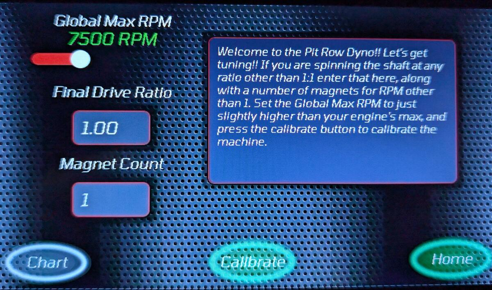
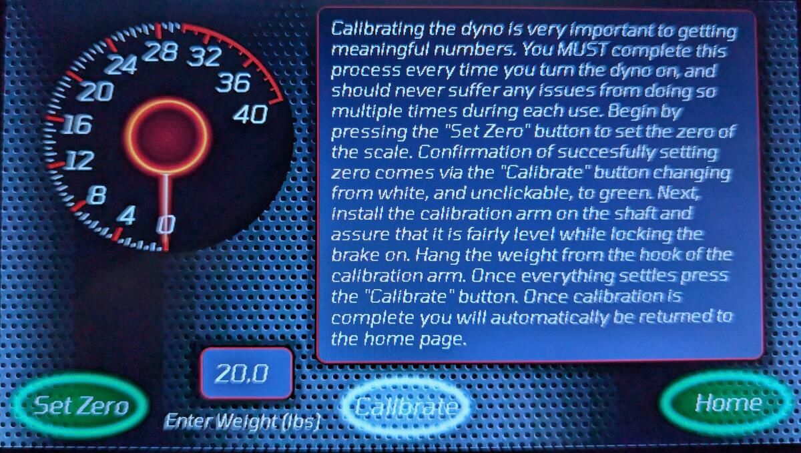
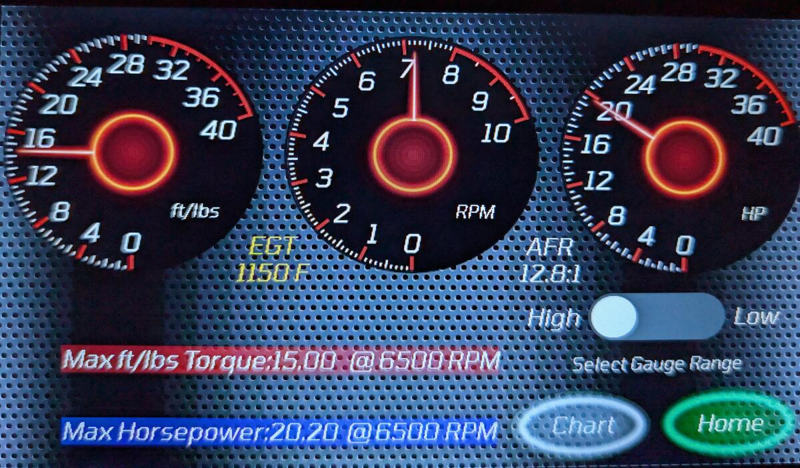
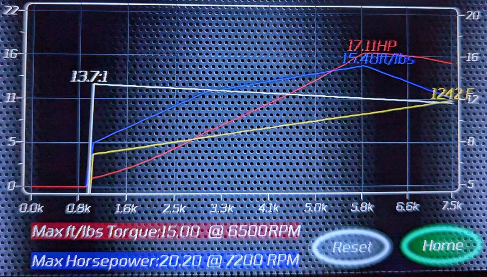
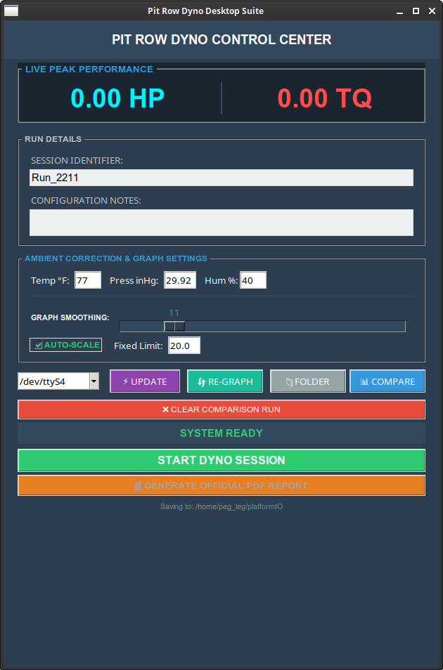
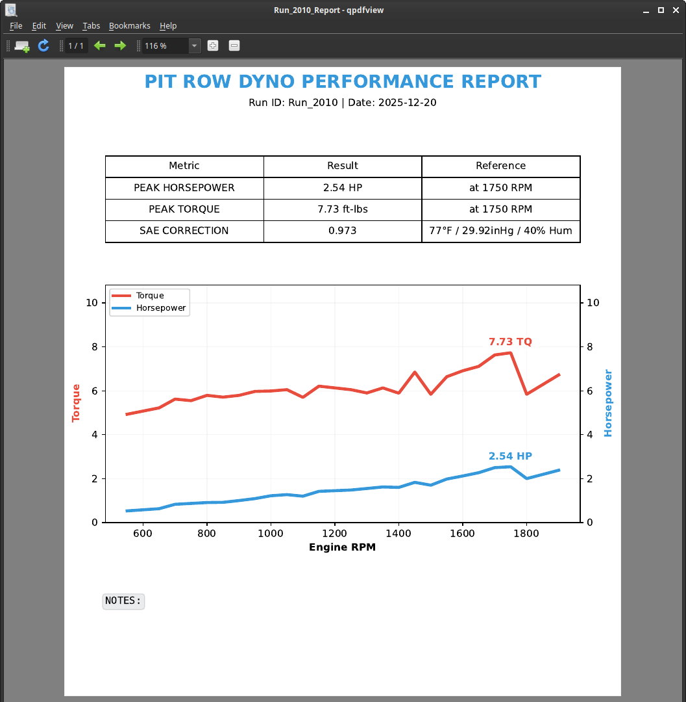
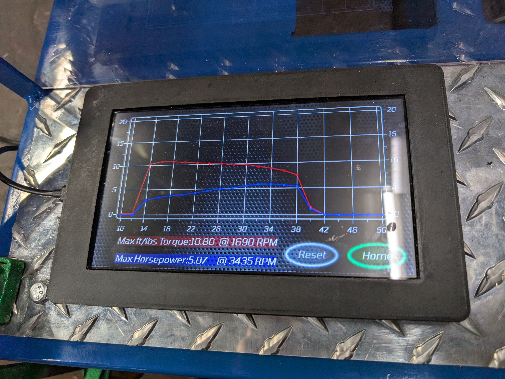

# Pit Row Controller OS
### The Open-Source Data Acquisition System for Rotating Machinery

**Universal. Configurable. Standalone.**

The **Pit Row Controller** is a standalone engine management and dyno data acquisition system designed to run on the ESP32 platform. Originally developed for small engine dynamometers, this system is **chassis-agnostic**.

**Whether you are building a custom DIY brake dyno or retrofitting modern data acquisition onto an existing chassis, this controller handles the math so you can focus on the tuning.**

## Features
* **Universal Input:** Configurable for any gear ratio, magnet count, or load cell calibration.
* **Auto-Scaling Graphs:** Software dynamically adjusts to any torque or RPM range.
    * *Software Dynamic Range: Unlimited.*
* **Dual-Mode Operation:**
    * **Freestyle:** Live, responsive gauges for tuning, break-in, and instant feedback.
    * **Dyno Run:** Automated logging, power curve generation, and peak value capture.
* **Touch Interface:** Optimized for 7" Sunton ESP32 screens with LVGL graphics.
* **Desktop Companion:** Connects to the Pit Row Desktop App for detailed analysis and report generation.

## Hardware Support
The OS is designed to run on the **Sunton ESP32-8048S070** (7-inch Touchscreen) and supports the following standard sensors:

* **Core:** ESP32-S3 (Sunton Board)
* **Torque:** HX711 Load Cell Amplifiers (with Auto-Tare on boot)
* **RPM:** Hall Effect Sensors (NJK-5002A or similar)
* **Temp (EGT):** MCP9600 Thermocouple Amplifiers (K-Type)
* **AFR:** 0-5V Analog Wideband Controllers (Compatible with AEM, Innovate, etc.)

## Getting Started

### 1. Flash the Firmware
The core firmware is located in the `/firmware` directory. You can flash this directly to your Sunton board using PlatformIO.

### 2. Wire Your Rig
We provide reference wiring diagrams in the `/wiring` folder.
* **Base Model:** The standard setup for basic Load/Brake dynos (RPM + Torque).
* **Expanded Model:** Adds EGT and AFR logging capabilities for full engine tuning.

### 3. Configure Your Physics
Once booted, use the on-screen **Settings Menu** to input your specific mechanical ratios:
* **Final Drive Ratio** (Engine to Absorber)
* **Magnet Count** (Pulse per Revolution)
* **Calibration Weight** (For Load Cell setup)

## Mechanical Builds
Looking for the Pit Row Dyno frame plans?
The mechanical designs, laser-cut DXF files, and welding guides for our reference chassis are located in the **[Pit Row Mechanical Repo](https://github.com/notforhire/small_engine_dyno)**.

---

### License
This project is Open Source. See the `LICENSE` file for details.